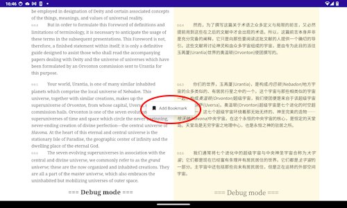
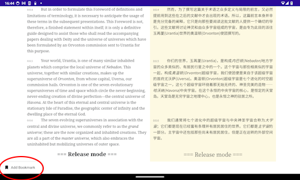
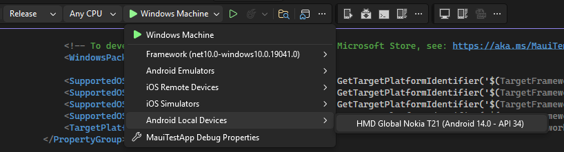

# BootstrapBlazor Context Menu Issue 7450
A minimal repo for issue 7450 of BootstrapBlazor

## Context menu positioning fails in release configuration on Android in a dotnet MAUI app

I'm using BootstrapBlazor in a dotnet MAUI app (net10) with a BlazorWebView.
In the app a [ContextMenu](https://github.com/dotnetcore/BootstrapBlazor/tree/main/src/BootstrapBlazor/Components/ContextMenu) is being used.

When I test the app in debug mode on an Android device the context menu behaves as expected. 
But when I test the app in release mode on an Android device the context menu is always rendered in the bottom-left corner of the screen.

*Debug mode*

*Release mode*

I created an example app to demonstrate the issues. See this repo.

I tested this on:
* Nokia Phone 7.2 (Android version 11)
* Nokia Tablet T21 (Android version 14)

It works well on a Windows device.
I'm not yet able to test this on an Apple device.

### Expected Behavior

The context menu should be rendered near the touched location in release mode, instead of the bottom left corner.

### Interactive render mode

Interactive WebAssembly (Client-side rendering (CSR) using Blazor WebAssembly)

### Steps To Reproduce

1. Connect an Android device to your Dev machine
1. Open this project in Visual Studio (2026)
1. Set the configuration to "Debug"
1. Run the app on your local connected device

1. Confirm that the context menu behaves normal
1. Switch the configuration to "Release"
1. Run the app on your local connected device
1. Click in the text. The context menu appears on the screen in the bottom-left corner. If you don't see a context menu swipe to the bottom of the screen. 

### .NET Version

NET10.0

### Anything else?

IDE: Visual Studio 2026
.NET Version: 10
BootstrapBlazor Version: 10.2.0
App type: .NET MAUI Hybrid Blazor

